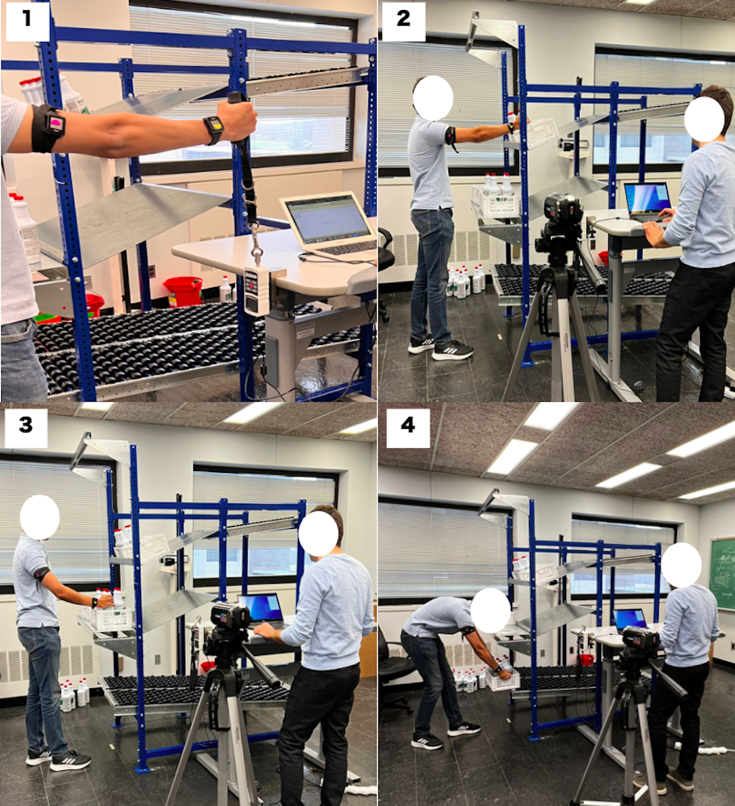

## Title

**Predictive Modeling of Human Fatigue and Recovery**

--- 

## Project Members:  
- **Setareh Kazemi Kheiri, Department of Industrial Engineering, University of Pittsburgh**, **skazemi@pitt.edu**
- **Sahand Hajifar, Robert W. Plaster School of Business, Park University**, **sahand.hajifar@park.edu**
- **Fadel M. Megahed, Farmer School of Business, Miami University**, **fmegahed@miamioh.edu**
- **Lora A. Cavuoto, Department of Industrial and Systems Engineering, University at Buffalo**, **loracavu@buffalo.edu**
- **Hongyue Sun, College of Engineering, University of Georgia**, **hongyuesun@uga.edu**

---
## Objective:

In this document all the data related to the associated paper entitled "Predictive Modeling of Human Fatigue and Recovery" are provided. The main objective of this research is gaining a better understanding of fatigue and recovery dynamics during manual material handling (MMH) operations in a simulated warehousing environment. 

---
## Introduction of the Experiment and Data:
Data used in this study is driven from an experiment conducted to assess the fatigue accumulation of **upper limb fatigue** in a repetitive overhead load lifting task. The experiment was conducted with four different conditions, with varying: (a) **task weights:** 1.5 and 2.5 kg, and (b) **task paces:** 5, 10, and 15 bpm. The four conditions are based on the following combinations of pace and weights: 

- 5 bpm -- 2.5 kg,   
- 10 bpm -- 2-5 kg,   
- 15 bpm -- 2.5 kg, and   
- 15 bpm -- 1.5 kg 

A total of 17 people participated in this experiment. Participants completed four laboratory sessions, each separated by at least three days to minimize carryover fatigue effects. Each session comprised three 45-minute blocks of over-shoulder order picking, with two 15-minute rest breaks between blocks. A demonstration of the different stages of the experiment task is shown in the below figure.
Before beginning, participants sat quietly for five minutes to establish a resting heart rate, then performed a brief shoulder warm-up using a dumbbell, including lateral and frontal raises.
Each session began with a baseline measurement of maximum voluntary isometric contraction (MVIC) of the right shoulder, repeated every nine minutes throughout the task (Picture 1). For each measurement, participants stood before a force gauge dynamometer (Mark-10, Mark-10 Corporation, Copiague, NY) with the shoulder flexed at 90&deg, and exerted maximum upward force on the device strap for six seconds. These measurements are referred to as "muscle strength" measurements throughout. Verbal cues were provided at the start and end of each measurement.
The picking task was paced using a metronome. On each beep, participants used their right hand to retrieve a bottle from a box at shoulder height and transfer it to a box at waist height (Pictures 2 and 3), resting the arm between beeps. After five bottles were transferred, the waist-height box was lowered to a conveyor at knee height (Picture 4). Participants rated their perceived exertion every five minutes using the [Borg 0-10 Ratings of Perceived Exertion (RPE) Scale](https://my.clevelandclinic.org/health/articles/17450-rated-perceived-exertion-rpe-scale).

---
## Data Files: 

In the [**data**](data) folder below files can be found:
   1. [Participants_Anthropometrics.xlsx](data/Participants_Anthropometrics.xlsx): In this file the anthropometrics of participants are saved including their: gender, age, height(cm), weight(kg), waist circumference (cm), hip circumference (cm), and body mass index (BMI).
   2. [NIOSH_Experiment_Settings.xlsx](data/NIOSH_Experiment_Settings.xlsx): In the sheet "For analysis" of this file the random order of task conditions (combinations of load and pace) are assigned to different participants. This file is later used in the analysis to understand what task condition was performed in each session of the experiment. 
   3. [full_sensor_data](data/full_sensor_data) folder includes the [IMU_raw_data.md](data/IMU_raw_data.md): This markdown provides the link to access the large raw IMU and RPE data for download, along with the full description of its content.
   4. [changepoints.csv](data/changepoints.csv): In this file the changepoints identifying the start and end of each work and break period in Unix time format are provided. CP1 shows the timestamp the experiment starts, CP2 the timestamp the first work period ends and the first break starts, CP3 the timestamps the first break ends and the second work period starts, CP4 the timestamp the second work period ends and the second break starts, CP5 the timestamps the second break ends and the thirs work period starts, and CP6 the timestamps the experiment ends. NA values mean that the experiment was not conducted and no data is available for that unique subject session combination.
   5. The [python_data](data/python_data) folder contains supporting documentation for the Python version of the dataset, including a markdown file that provides the download link and a detailed description of the data structure. The dataset is organized as a dictionary with three components: `ts_data` (IMU sensor data, RPE, and activity labels per participant-session), `anthro_clean` (participant demographic and anthropometric data), and `experiment_settings` (load and pace conditions per session). This Python version includes only the first 45 minutes of each session (work period); recovery data are not included in the current release but will be added in a future update.

---
